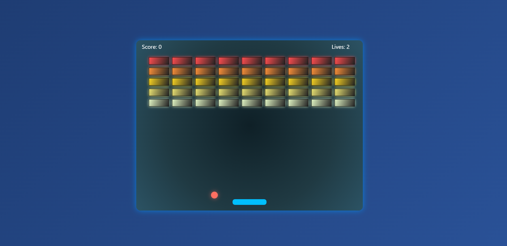

# 🧱🎾 Breakout Game
Welcome to Breakout Game – a colorful, modern twist on the classic paddle-and-brick arcade game, built with JavaScript and HTML5 Canvas!

## 📸 Preview


## ✨ Features
🧱 Colorful Bricks: 5 rows, 9 columns, each row with a unique color.

🎾 Glowing Ball: Ball with shadow and gravity for dynamic gameplay.

🕹️ Smooth Paddle: Rounded paddle, easy left/right movement.

💥 Brick Collision: Break bricks, score points, and win!

❤️ Lives System: 3 lives before game over.

🏆 Win & Game Over Screens: Clear, animated messages.

🌈 Gradient Effects: Bricks and ball have stylish gradients and glows.

## 🚀 Getting Started
 Clone or Download
```bash
git clone https://github.com/Sasank-5716/HTML_canvas
```
```bash
cd Arkanoid
```

## 🎮 Controls
Action	Key	Icon
Move Paddle Left	⬅️ Left Arrow	:arrow_left:
Move Paddle Right	➡️ Right Arrow	:arrow_right:
Restart	Refresh Page	:arrows_counterclockwise:
---
## 📝 How to Play
Move the paddle with your left/right arrow keys.

Bounce the ball to break all bricks.

Don’t let the ball fall! You have 3 lives.

Win by clearing all bricks. Lose if you run out of lives.
---
## 🛠️ Built With
JavaScript

HTML5 Canvas
---

## 📚 Credits & Inspiration
🎨 Inspired by classic arcade games.

🧱 Brick and ball icons by Icons8.

Have fun breaking bricks! 🧱🎾