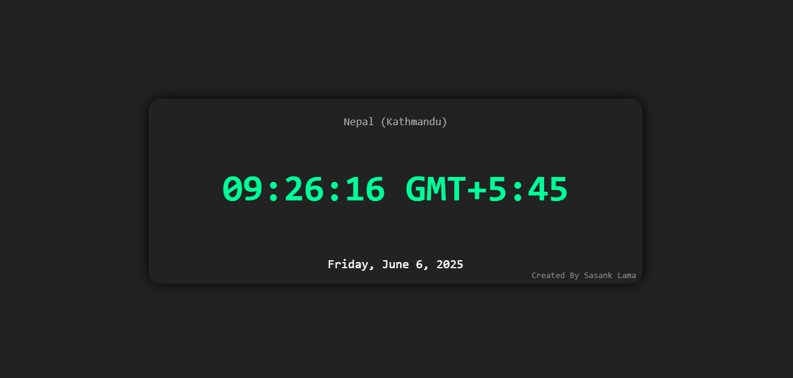

# Digital Clock (Canvas)
A modern, digital clock for Kathmandu, Nepal, rendered beautifully on an HTML5 Canvas using JavaScript. This clock displays the current time, date, and time zone abbreviation for the Asia/Kathmandu time zone, with a stylish, readable design.

## 🕰️ Features
Live Digital Time: Updates every second, always accurate.

Nepal (Kathmandu) Time Zone: Uses the official Asia/Kathmandu time zone.

Readable Date Display: Shows the full date (weekday, day, month, year).

Time Zone Abbreviation: Clearly displays the current time zone abbreviation.

Stylish Canvas Design: Dark theme with neon green time and gold time zone.

Attribution: Credits the creator at the bottom right.

## 🚀 Getting Started
Clone this project
```bash
git clone https://github.com/Sasank-5716/HTML_canvas
```
```bash 
cd Digital_clock
```

## 🎨 Customization
Country/City Label: Change the countryLabel variable.

Time Zone: Change the timeZone variable to any valid IANA time zone.

Colors & Fonts: Adjust ctx.fillStyle and ctx.font in the JS for your preferred style.

Canvas Size: Modify the width and height attributes of the <canvas> tag.

## 📄 Code Overview
drawClock(): Clears the canvas, fetches the current time in the specified time zone, and draws all elements (country label, time, time zone, date, and credits).

setInterval(drawClock, 1000): Updates the clock every second for real-time accuracy.

## 🖼️ Example Output


Enjoy your beautiful Kathmandu digital clock! 🇳🇵🕰️