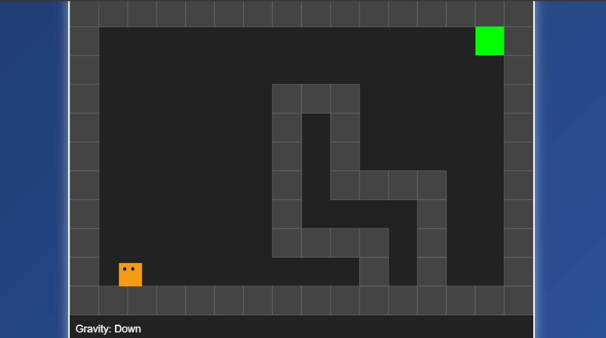

# Gravity Puzzle Platformer
A browser-based puzzle platformer game where you manipulate gravity to navigate challenging levels. Built with HTML5 Canvas, CSS, and JavaScript, this game features smooth controls, engaging visuals, and advanced gravity-switching gameplay.

# 🎮 Features
 Gravity Manipulation: Change gravity in four directions (down, up, left, right) to solve puzzles.

 Platformer Controls: Move left/right relative to the current gravity.

 Challenging Level: Navigate obstacles and reach the green goal tile to win.

 Responsive Visuals: Crisp, modern design using HTML5 Canvas and CSS.

 Keyboard Controls: Intuitive controls for movement and gravity switching.

## 🚀 How to Play
Move Left/Right:

A / Left Arrow — Move left

D / Right Arrow — Move right

## Change Gravity:
Arrow Down — Gravity Down

Arrow Up — Gravity Up

Q — Gravity Left

E — Gravity Right

## Goal:
Reach the green tile to complete the level!

## 🛠️ Installation & Running
Clone or Download this repository.
```bash
git clone https://github.com/Sasank-5716/HTML_canvas
```
```bash
cd Gravity_puzzle_platformer
```

Ensure the following files are in the same directory:

puzzle_platformer.html

puzzle_platformer.css

puzzle_platformer.js

Open index.html in your web browser.

No additional dependencies required!

## 📁 File Structure
tree /f
/gravity-puzzle-platformer
│
├── index.html      # Main HTML file
├── styles.css      # CSS for styling
└── game.js         # JavaScript game logic

## 📷 Screenshots



Inspired by classic gravity puzzle games.

Enjoy the challenge! 🚀