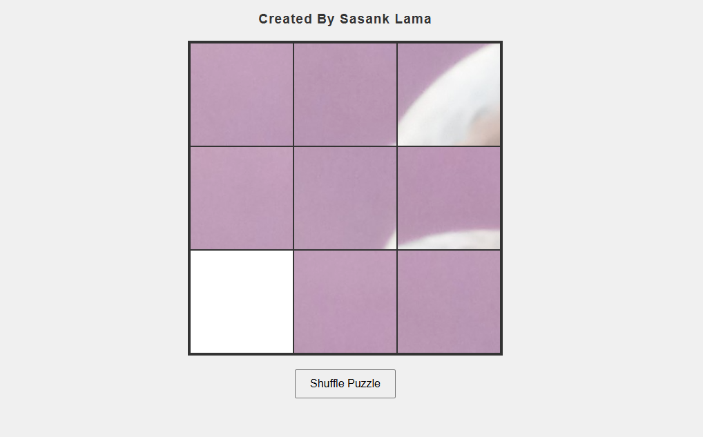

# Sliding Puzzle Game
A simple image-based sliding puzzle game built with JavaScript and HTML5 Canvas. This project creates a 3×3 sliding puzzle using a custom image, allowing users to shuffle and solve the puzzle interactively.

## Features

3×3 sliding puzzle grid (8 tiles + 1 empty space)

Uses your own image (sasank02.jpg)

Shuffle button to randomize the puzzle

Click tiles adjacent to the empty space to move them

Visual grid lines and empty space highlight

Congratulatory message when solved

## Demo



## Get Started
 Clone or Download the Repository
```bash
git clone https://github.com/Sasank-5716/HTML_canvas
```
```bash
cd Image_puzzle_game
```

## How to Play
Click the Shuffle button to randomize the puzzle.

Click on any tile adjacent to the empty space to move it.

Continue moving tiles until the image is correctly assembled.

When solved, a congratulatory message appears.

## Customization
Image: Replace sasank02.jpg with any square image of your choice.

Grid Size: To change the puzzle size, modify the tileCount variable in puzzle.js.

## Requirements
Modern web browser (Chrome, Firefox, Edge, Safari)

No external dependencies

## Credits
Developed by [Sasank Lama]

Inspired by classic sliding puzzles


For questions or suggestions, feel free to open an issue or pull request.